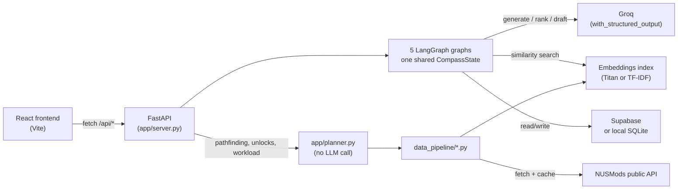

# 🧠 NUS Compass

**An AI agent that plans, acts, and adapts a student's university trajectory over time.**

Built for the SimplifyNext 2026 Agentic AI Hackathon ("Design for a World in Transformation").

An NUS student's information isn't missing — it's fragmented across modules, professors, internships, research openings, competitions, and scholarships that are all quietly interconnected. NUS Compass turns that into a single planning layer: it builds a model of where a student wants to be in a few years, proposes concrete trajectories to get there, ranks the handful of moves that matter most *this semester*, drafts the outreach to act on them, and re-scores everything as the student's real choices accumulate — the plan adapts instead of going stale.

This is a working full-stack app, not a slide deck — see [Status](#status) for exactly what's been verified.

## Contents

- [Features](#features)
- [Tech stack](#tech-stack)
- [Architecture](#architecture)
- [Quick start](#quick-start)
- [API](#api)
- [Real vs. synthetic data](#real-vs-synthetic-data)
- [Project structure](#project-structure)
- [Status](#status)
- [Contributing](#contributing)

## Features

| Tab | What it does |
|---|---|
| **Intake** | Student states year, CAP, modules taken, interests, and a 3-year goal in plain English. |
| **Trajectories & Moves** | Groq generates 2–3 named, distinct trajectory paths tailored to that goal, then ranks the top 5 highest-leverage moves for the current semester — a module, an application, a meeting, an event, or an explicit "don't do this" to guard against overcommitment. |
| **Outreach** | Drafts a personalized outreach email to a professor or opportunity contact, grounded in the student's real profile. Every draft requires human approval — nothing is ever sent automatically. |
| **What-if** | Re-runs trajectory generation and leverage scoring under a different constraint (e.g. weight CAP over internships) as a **new**, separate trajectory set — the baseline is never overwritten, so both can be compared side by side. |
| **Checkpoint** | Logs real actions the student takes over time and recomputes how well each trajectory's expected path still aligns with what actually happened. |

**Also in the backend** (not yet wired into the UI — see [Status](#status)): a prerequisite-graph **planning engine** (`app/planner.py`) that finds an AND/OR-correct module path to a target course, analyzes what a module actually unlocks relative to the student's chosen trajectory, and checks semester workload feasibility against NUSMods' real per-module workload data.

## Tech stack

- **Backend**: Python, FastAPI, [LangGraph](https://github.com/langchain-ai/langgraph) (5 small linear graphs sharing one state), LangChain
- **LLM**: Groq (`openai/gpt-oss-20b`, free tier) by default; AWS Bedrock as a drop-in alternative
- **Embeddings**: AWS Bedrock Titan Embed Text v2, with an automatic local TF-IDF fallback (`scikit-learn`) requiring no AWS setup
- **Storage**: Supabase (hosted Postgres), with an automatic local SQLite fallback requiring no external service
- **Frontend**: React + Vite
- **Data**: [NUSMods public API](https://api.nusmods.com) (real module catalog + prerequisite trees)

Every external dependency except the LLM call itself has a zero-setup local fallback — see [`docs/DEVELOPMENT.md`](docs/DEVELOPMENT.md).

## Architecture



Five deliberately small, **linear** graphs (no back-edges or conditional loops — none need iteration) share one `CompassState`, so each feature stays independently testable and every model-calling node is a single `chat_model().with_structured_output(...)` call rather than a ReAct tool loop. Full design rationale, data pipeline details, and the storage/embeddings fallback mechanics are in [`docs/ARCHITECTURE.md`](docs/ARCHITECTURE.md).

## Quick start

```bash
uv sync                              # or: python -m venv .venv && .venv/Scripts/pip install -e .
cp .env.example .env                 # fill in GROQ_API_KEY (free, no card — console.groq.com)
cd frontend && npm install && cd ..
uv run python run_pipeline.py        # fetch real NUSMods data, build the prereq graph + embeddings
uv run python run_dev.py             # backend on :8000 (docs at /docs), frontend on :5173, one command
```

Full setup (including optional AWS Bedrock / Supabase configuration, and a terminal-only walkthrough via `demo_cli.py`) is in [`docs/DEVELOPMENT.md`](docs/DEVELOPMENT.md).

## API

| Method & path | Purpose |
|---|---|
| `POST /students` | Create or update a student profile |
| `GET /students/{id}` | Fetch a student profile |
| `POST /students/{id}/trajectories` | Generate trajectory paths (intake graph) |
| `POST /students/{id}/leverage-moves` | Rank this semester's top 5 moves |
| `POST /students/{id}/outreach` | Draft an outreach email for approval |
| `POST /outreach/{draft_id}/approve` | Approve or reject a draft |
| `POST /students/{id}/whatif` | Re-plan under a different weighting, as a new trajectory set |
| `POST /students/{id}/checkpoint` | Recompute alignment against the baseline plan |
| `POST /students/{id}/actions` | Log a real-world action (lets a demo "fast-forward" time) |
| `GET /planner/path/{id}/{module}` | AND/OR-correct module path to a target |
| `GET /planner/unlocks/{module}` | What a module unlocks, scored against the student's trajectory |
| `POST /planner/workload` | Total weekly workload hours for a set of modules |

Full request/response shapes: run the server and open `/docs` (interactive Swagger UI), or see [`docs/ARCHITECTURE.md`](docs/ARCHITECTURE.md).

## Real vs. synthetic data

- **Real**: the NUS module catalog and prerequisite graph — 727 modules across Computing, AI-adjacent quant faculties, and business/entrepreneurship, live-fetched from NUSMods for academic year 2025–2026.
- **Synthetic**: professors, internships/RA openings, competitions, scholarships, and alumni stories — a small (~10–15 entries each), hand-authored dataset in `data_pipeline/synthetic/`. No real people, students, or companies.

## Project structure

```
app/            FastAPI + 5 LangGraph graphs + the planning engine
data_pipeline/  NUSMods fetch, prerequisite graph builder, embeddings, synthetic data
frontend/       React + Vite UI
docs/           ARCHITECTURE.md (build details) and DEVELOPMENT.md (setup/run/troubleshooting)
run_dev.py      one command: backend + frontend together
demo_cli.py     terminal walkthrough of the full narrative, no UI needed
```

Full annotated layout: [`docs/ARCHITECTURE.md`](docs/ARCHITECTURE.md).

## Status

Verified against real data end to end, not just designed: real NUSMods fetch and prerequisite parsing, the TF-IDF and SQLite fallbacks, all 5 graphs compiling and running, the full frontend-to-backend request path in a live browser, and real Groq-generated trajectories/leverage moves/outreach drafts — confirmed via live API response metadata (token usage, `system_fingerprint`) to rule out a mock, and confirmed to produce genuinely different output across distinct student profiles rather than canned text.

**Known limitations**: the LLM path has no fallback by design — a missing `GROQ_API_KEY` returns a clean 503, not degraded output, since generation is the actual product. The planning engine's endpoints aren't wired into the UI yet. No automated test suite yet; correctness has been established through live verification against real APIs and real data rather than unit tests.

## Contributing

Branch per change (`feat/`, `fix/`, `docs/`, `chore/`), PR review before merging to `main` — see [`AGENTS.md`](AGENTS.md) for the full contribution rules.
